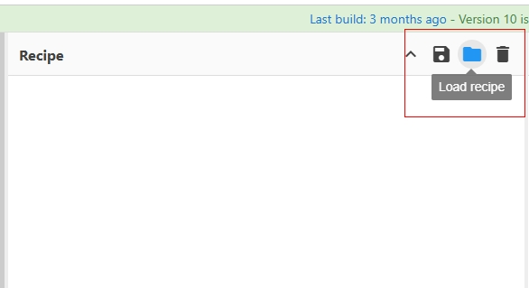
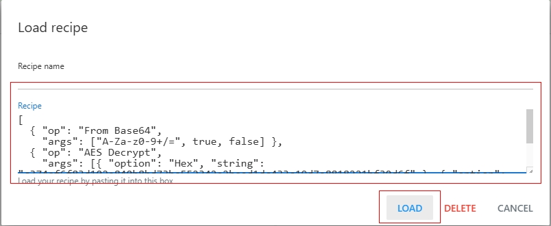
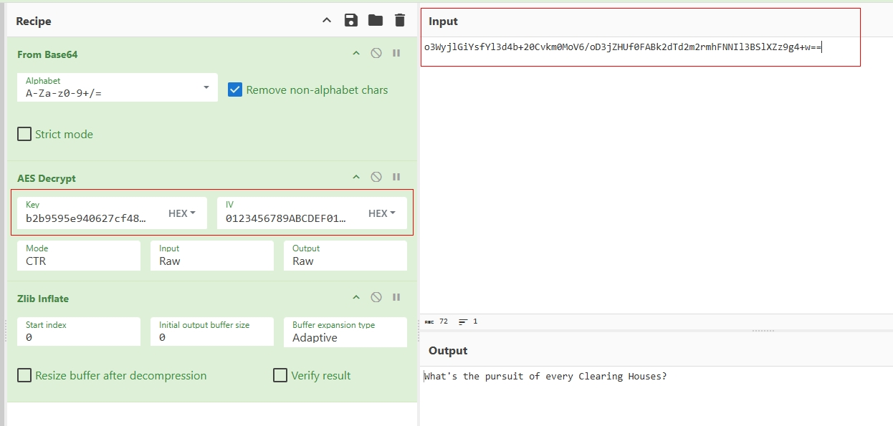

# BBS MESSAGE ARCHIVER

## Overview
Many BBS services don't support Archive Operations yet. When you have the need to Archive some messages you posted, but prefer not removing right away. This project provides a solution to Encrypt your message. You could update your post with Ciphered Message, and keep the Key somewhere for later Decryption. This project, for your convenience, takes a natual language text string as the Key instead of a HEX string.

## Techinal Details
```
                                  (Original Message) --- [Compression] --- 
                                                                          |
(Natual Language Key String) --- [SHA256] --- [HEX Key] ---               |
                                                           | --- [AES-256-CTR Cipher] --- (Archived Cipher Message)
                                               (HEX IV) ---
```

## Example

### Original Message
```
What's the pursuit of every Clearing Houses?
```

### Key Text
```
No Default !
```

### Archived Cipher Message (Update This To Your BBS Post)
```
ARCHIVE TIME: 2025-11-06 15:52:48
DE-ARCHIVE INSTRUCTION: https://github.com/davychxn/BBS-MSG-ARCHIVER
ENCRYPTION ALGORITHM: AES-256-CTR
PADDING: NONE (stream mode)
NOTE: Compatible with CyberChef (full 16-byte counter, big-endian)

-- KEY --
KEY TEXT: <YOUR KEY TEXT HIDDEN>
KEY (hex): b2b9595e940627cf48ac78c28cf102b90a335b3a3dbd85f6ce17c848e890c8aa

-- IV / NONCE --
FULL IV (hex): 0123456789ABCDEF0123456789ABCDEF

-- ARCHIVED TEXT --
ARCHIVED TEXT (base64):
o3WyjlGiYsfYl3d4b+20Cvkm0MoV6/oD3jZHUf0FABk2dTd2m2rmhFNNIl3BSlXZz9g4+w==
```

### CyberChef Recipe
[Definition of Decryption](./cyberchef/CyberChef_Decrypt_Recipe.txt)

## Environment Preparation
1. Clone the Project to your local drive.
2. (Optional) Install Python dependent packages:
```
python -m pip install --upgrade pip
python -m pip install cryptography
```

## Archive Operations
1. Copy `Original Message` to `./encrypt_input.txt`.
2. Write your Natual Language `Key String` to `./key.txt`.
3. (Optional) [Environment Preparation](#environment-preparation).
4. Run in System Cmd Console:
```python
python bbs_msg_archiver.py
```
5. Update complete content of `./archive_output.txt` to your BBS Post.

## De-Archive Operations
1. Copy `Archived Cipher Message` only from Field `ARCHIVED TEXT (base64)` of `./archive_output.txt` to `./encrypt_output.txt`:
```
-- ARCHIVED TEXT --
ARCHIVED TEXT (base64):
[[[ARCHIVED CIPHER MESSAGE HERE]]]
```
2. Write your Natual Language `Key String` to `./key.txt`.
3. (Optional) [Environment Preparation](#environment-preparation).
4. Run in System Cmd Console:
```python
python bbs_msg_dearchiver.py
```
5. Get `Original Message` from `./decrypt_output.txt`.

## De-Archive Operations With Online AES Decrypt Tools

### CyberChef Example
1. Open CyberChef: https://gchq.github.io/CyberChef/

2. Load CyberChef Decrypt Recipe here:


3. Copy content of [CyberChef Decryption Recipe](./cyberchef/CyberChef_Decrypt_Recipe.txt) to `Recipe`, and LOAD:


4. Do the following values copy:
 __________________________________________________________________________________________
|  COPY  |       FROM (FILE: archive_output.txt)       |   TO (CyberChef: AES Decrypt UI)  |
|--------|---------------------------------------------|-----------------------------------|
| FIELDS | KEY (hex)                                   | Key (HEX)                         |
| FIELDS | FULL IV (hex)                               | IV (HEX)                          |
| FIELDS | ARCHIVED TEXT (base64)                      | Input                             |

5. BAKE to Output:


## Cleanup Operations

### Cleanup Outputs
Run in System Cmd Console:
```python
python cleanup_output_only.py
```

### Cleanup Outputs + Truncate Input & Key To 0 Size
Run in System Cmd Console:
```python
python cleanup_all.py
```

## All Cmds Reference

### Encrypt
```python
python bbs_msg_archiver.py
```
### Decrypt
```python
python bbs_msg_dearchiver.py
```
### Cleanup Outputs Only
```python
python cleanup_output_only.py
```
### Cleanup Both Inputs & Outputs
```python
python cleanup_all.py
```
### Install Python Package Dependents
```
python -m pip install --upgrade pip
python -m pip install cryptography
```

## Contribution
Contributions are welcome! Please submit a pull request for any enhancements or bug fixes.
